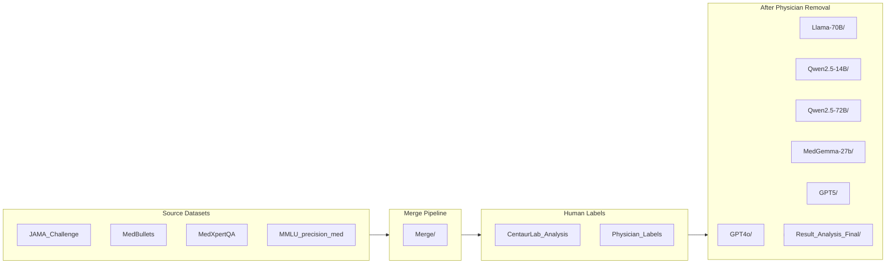

# NeuRIPS25 — MedPAIR

Benchmarking the impact of spurious (irrelevant) context sentences on LLM performance across medical QA datasets. Human (physician + crowd) labels are used to identify and remove low-relevance context, and model accuracy is compared before and after removal.

---

## Pipeline Overview



---

## Where to Find Things

| What I'm looking for | Where to look |
|---|---|
| Raw per-model predictions (before/after removal) | `After_PT_Removal/<model>/` |
| Final accuracy metrics (all datasets) | `After_PT_Removal/Result_Analysis_Final/accuracy_metrics_*.csv` |
| All-models merged results | `After_PT_Removal/Result_Analysis_Final/all_models_merged.csv` |
| Figure scripts and outputs | `After_PT_Removal/Result_Analysis_Final/` (see `Figure 4 Making.ipynb`, `new_dotplot.py`) |
| Sankey diagrams (interactive HTML) | `After_PT_Removal/GPT5/` |
| Physician / clinician labels (Mar 2026 batch, 933 majority vote, raw export) | `Physician_Labels/Mar2_2026_Data/` |
| Model vs. physician match-rate tables | `Physician_Labels/results/` |
| Centaur Lab crowdsource labels | `CentaurLab_Analysis/` — see `Centaur_Lab_Classification.csv` |
| Centaur Lab analysis notebooks | `CentaurLab_Analysis/CentaurLab_Analysis.ipynb`, `Centaur_70B_Alignment.ipynb` |
| Sentence attribution scores (ContextCite) | `MedBullets/Attribution Scores_14B/`, `Merge/Merge_Attribution_Scores_14B_Analysis/` |
| Cross-dataset merged questions (2k/4k) | `Merge/merged_2k_with_4k_ID.csv` |
| Cross-dataset analysis notebooks | `Merge/` |
| Data contamination / Mink++ | `mink-plus-plus/` |
| Qualitative / survey data | `After_PT_Removal/Qualitative Analysis/` |
| Perplexity analysis | `After_PT_Removal/shared/notebooks/Perplexity.ipynb` |
| NLP analysis script | `After_PT_Removal/shared/scripts/NLP_Analysis.py` |
| Dataset-specific notebooks | `JAMA_Challenge/`, `MedBullets/`, `MedXpertQA/`, `MedQA/`, `HeadQA/`, `MMLU_precision_med/` |

---

## Directory Structure

```
NeuRIPS25/
├── After_PT_Removal/         Per-model before/after spurious removal results
│   ├── GPT4o/
│   ├── GPT5/
│   ├── Llama-70B/
│   ├── MedGemma-27b-text-it/
│   ├── Qwen2.5-14B-Instruct/
│   ├── Qwen2.5-72B-Instruct/
│   ├── shared/                Shared Centaur CSVs, cross-model notebooks, NLP script
│   ├── Result_Analysis_Final/       Final aggregated metrics and figures
│   ├── Second_Round_Centaur_Lab_Result_Analysis/
│   └── Qualitative Analysis/        Pre/post study surveys
│
├── CentaurLab_Analysis/             Crowdsource labeling pipeline & outputs
├── Physician_Labels/                Ground-truth physician annotations
│   ├── Mar2_2026_Data/              Latest batch CSVs + analysis scripts
│   ├── notebooks/                   Accuracy / CDF notebooks
│   ├── results/                     Match-rate CSVs, 14B comparison stats
│   └── reference/                   Large Centaur reference dumps
│
├── Merge/                           Cross-dataset merge pipeline and merged CSVs
│
├── JAMA_Challenge/                  JAMA clinical QA dataset
├── MedBullets/                      MedBullets dataset + ContextCite attribution
├── MedXpertQA/                      MedXpertQA dataset
├── MedQA/                           MedQA benchmark
├── HeadQA/                          HeadQA benchmark
├── MMLU_precision_med/              MMLU professional medicine subset
├── NCCN/                            NCCN tree-of-thought reasoning
├── Reasoning/                       Reasoning tree visualizations
│
├── mink-plus-plus/                  Data contamination detection (standalone repo)
├── Unused_Files/                    Archived planning docs
└── myenv/                           Python virtual environment
```

---

## Unplaced Root-Level Files

The following files were found at root level but their exact destination is ambiguous:

| File | Notes |
|---|---|
| `qwen_rounds_comparison.csv` | Likely belongs in `After_PT_Removal/Qwen2.5-72B-Instruct/` or `Merge/` |
| `qtext_majority_predictions.csv` | Likely belongs in `HeadQA/` or `MedBullets/` |

---

## Models Evaluated

| Model | Folder |
|---|---|
| GPT-4o | `After_PT_Removal/GPT4o/` |
| GPT-5 | `After_PT_Removal/GPT5/` |
| Llama 3.1 70B | `After_PT_Removal/Llama-70B/` |
| Qwen 2.5-14B-Instruct | `After_PT_Removal/Qwen2.5-14B-Instruct/` |
| Qwen 2.5-72B-Instruct | `After_PT_Removal/Qwen2.5-72B-Instruct/` |
| MedGemma 27B | `After_PT_Removal/MedGemma-27b-text-it/` |

## Datasets Used

| Dataset | Folder | Notes |
|---|---|---|
| JAMA Clinical Challenge | `JAMA_Challenge/` | Clinical reasoning QA |
| MedBullets | `MedBullets/` | Step 2/3 board-style QA |
| MedXpertQA | `MedXpertQA/` | Expert-level medical QA |
| MMLU (professional medicine) | `MMLU_precision_med/` | Multiple-choice medical QA |
| MedQA | `MedQA/` | USMLE-style QA |
| HeadQA | `HeadQA/` | Spanish national exam QA |
